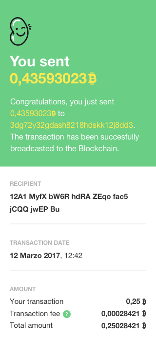

Create a responsive web page based on this layout:

## Specs
- The font used in the layouts is Helvetica Neue.
- The "Large" layout is 500px wide.
- Font size for the heading is 40px (large layout) and 30px (small layout).
- Font sizes used on texts are 18px, 15px, 12px.

## Rule
- You can use HTML5 and CSS3. IE10+ support is required.
- You can use a CSS preprocessor. In case of, write also the build scripts.
